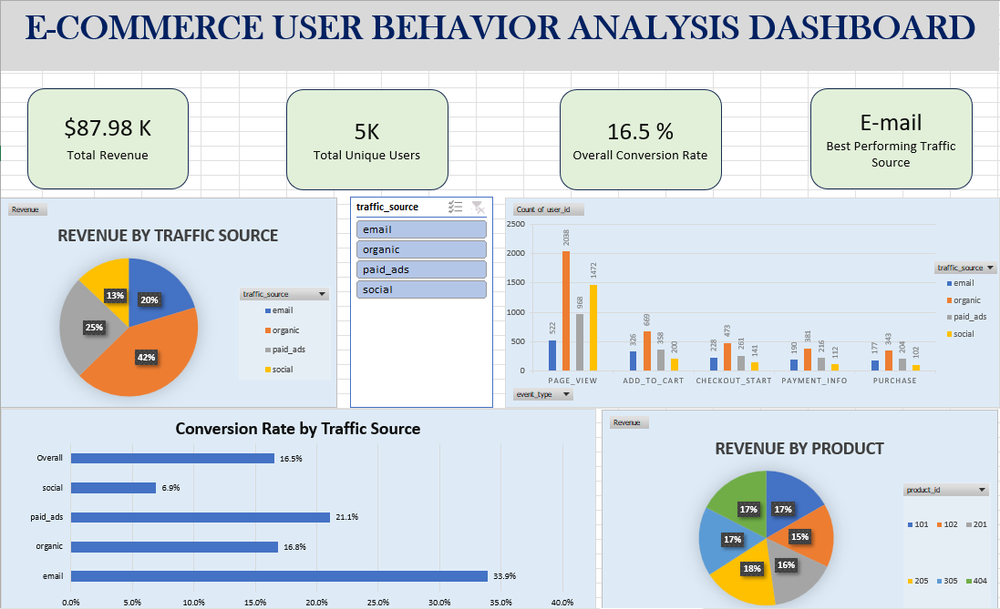

# E-Commerce User Behavior & Funnel Analysis

## Overview
Analysis of user behavior on an e-commerce platform, tracing the full conversion funnel 
from page view through purchase to identify drop-off points, traffic source performance, 
and revenue drivers. Built using MySQL and Excel, with results cross-validated between 
both tools.

## Dataset
About 9,400 events from 5,000 users, covering what action the user took (page view, add 
to cart, checkout, payment, purchase), where they came from (email, organic, paid ads, 
social), which product they viewed, how much they paid, and when it happened. This is a 
practice dataset created for learning purposes, not real company data.

## Data Cleaning
- The amount column was empty for every event except purchases. Filled these empty values 
  with 0, since only a completed purchase actually has a price, and leaving them blank 
  would have caused errors when adding up revenue.
- The event timestamps included very precise fractions of a second, which wasn't needed 
  and made time calculations messier. Cleaned this up so the timestamps could be used 
  properly to measure how long users took between each step.
- Checked the data for duplicate entries and inconsistent labels (like different spellings 
  of the same traffic source). Found none, so no rows had to be removed.

## Analysis Performed
- User funnel analysis (page_view → add_to_cart → checkout_start → payment_info → purchase)
- Traffic source analysis
- Conversion rate analysis (stage-by-stage and overall)
- Product performance
- Revenue analysis
- Customer journey timing (time taken between funnel stages)

## Tools Used
- MySQL
- Microsoft Excel (Pivot Tables, Dashboard)

## Key Findings
- Email brings in the smallest number of visitors but converts the best — about 33.9% of 
  email visitors end up buying, more than four times Social's rate of 6.9%.
- Paid Ads is the second-best converting channel at 21.1%, outperforming Organic (16.8%) 
  despite bringing in fewer visitors.
- Social is weakest right at the start — only about 13.6% of social visitors even add 
  something to their cart. This points to the social ads not matching what's actually on 
  the product pages, rather than a problem at checkout.
- Once someone adds a product to cart, they're very likely to follow through (70–94% 
  conversion at every step after that), no matter where they came from. The real problem 
  is getting people to add to cart in the first place.
- Organic traffic brings in the most total revenue (about 42%), mainly because of how many 
  people use it, not because each person spends more.
- All 6 products perform about the same, contributing between 15% and 18% of total revenue. 
  The product itself isn't the deciding factor — where the traffic comes from is.
- Users take the longest to decide whether to add a product to cart (about 11 minutes on 
  average), more than double the time spent on any step after that. Once someone commits 
  to buying, they move fast. This shows that the add to cart decision is the biggest 
  sticking point, both in how many people drop off and how long the ones who don't take 
  to decide.
- Total revenue: $87,975.11 from 826 purchases.

## Business Recommendations
- Spend more on email marketing. It turns visitors into paying customers more often than 
  any other channel.
- Paid Ads is converting well — worth analyzing what it's doing differently from Organic 
  and Social, and applying those lessons to underperforming channels.
- Find out why people coming from social media leave so fast. The social media ads might 
  be promising something different from what's actually shown on the product page.
- Put most of the effort into getting people to add a product to their cart, since that's 
  the point where the most people are lost, no matter where they came from.
- Keep growing organic traffic (people finding the site through search engines), since it 
  already brings in the most revenue and doesn't cost extra for ads.
- Don't worry too much about which specific product is being shown, since all 6 products 
  perform about the same. The bigger win is in improving how people arrive at the site, 
  not changing the products themselves.
- People take a long time deciding whether to add something to cart, but once they do, 
  they move fast through checkout and payment. So it makes more sense to improve the 
  product page (clearer info, better photos, convincing details) than to add discounts 
  at checkout, since checkout already works well on its own.
- Check this funnel regularly. If something starts going wrong, it's much easier to fix 
  early than after it's been losing customers for months.

## Visuals

### Dashboard

The dashboard includes:
- **KPI Summary** — Total revenue ($87.98K), unique users (5K), overall conversion rate 
  (16.5%), and best performing traffic source (Email)
- **Revenue by Traffic Source** — Organic leads with 42% of total revenue, followed by 
  Paid Ads (25%), Social (20%), and Email (13%)
- **Funnel by Traffic Source** — Grouped bar chart showing user counts at each funnel 
  stage (page view → add to cart → checkout → payment → purchase) across all four 
  traffic sources
- **Conversion Rate by Traffic Source** — Email converts at 33.9%, more than four times 
  Social's 6.9%; Paid Ads (21.1%) outperforms Organic (16.8%) despite lower traffic volume
- **Revenue by Product** — All six products contribute roughly equally, ranging from 15% 
  to 18%

### Traffic Source Analysis

### Product Analysis

## How to Use This Project
1. Open User_Events_Analysis.xlsx to explore the dashboard and pivot table breakdowns.
2. Run the queries in SQL_Queries.sql on a MySQL database with a matching user_events 
   table to reproduce the same results.

## Files
- SQL_Queries.sql
- User_Events_Analysis.xlsx
- user_events.csv (raw data)
